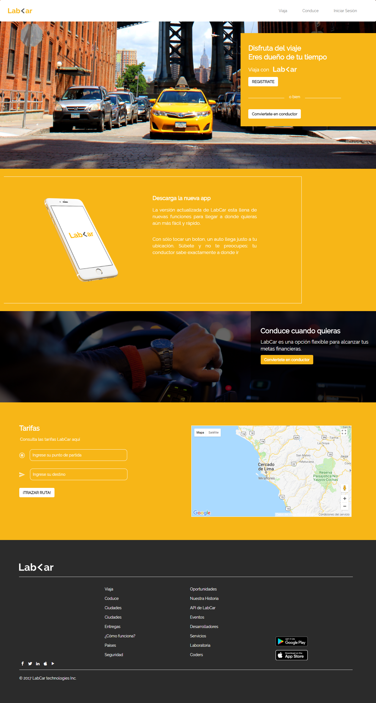
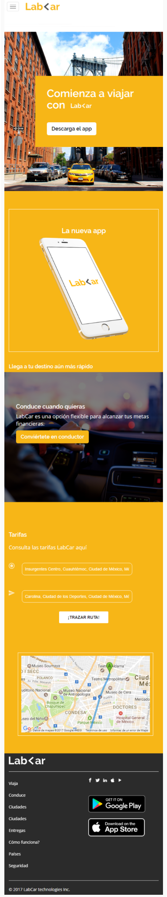
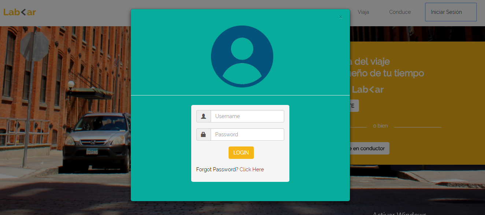
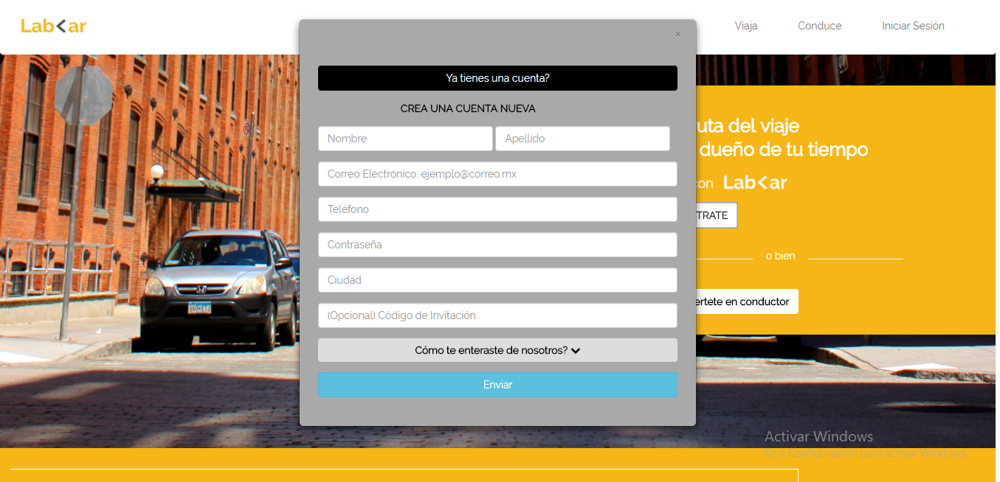
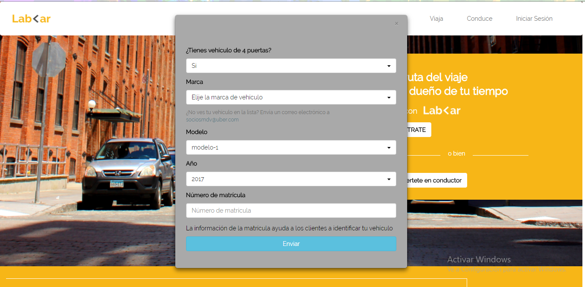
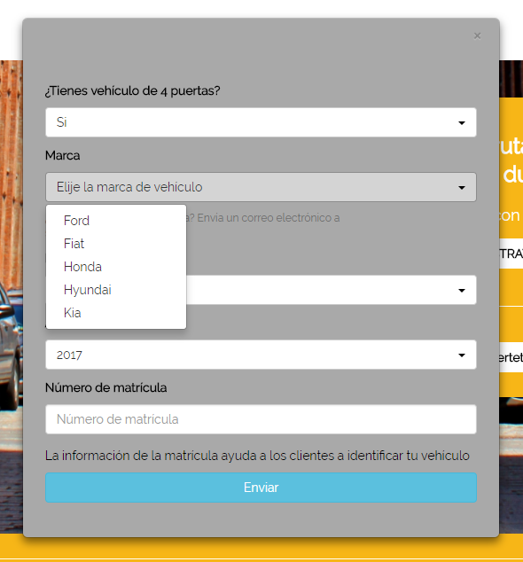
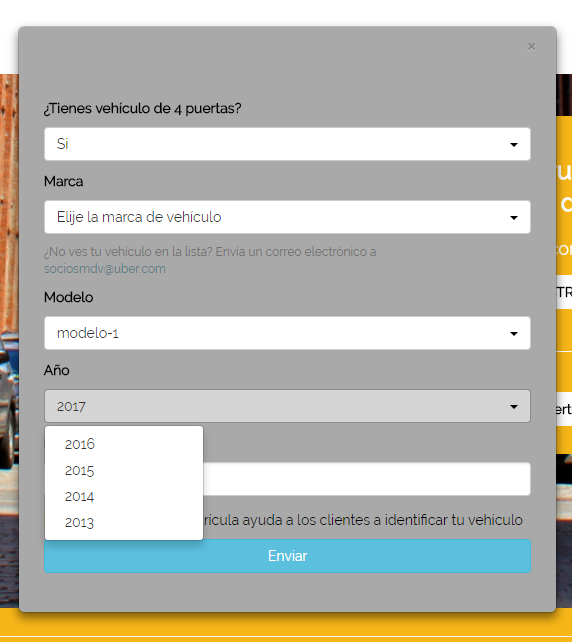

# LAB-CAR-BOILERPLATE
Este proyecto se realizo Mobile First y luego en su versión Desktop.
Tiene como objetivo facilitar a las persona a encontrar transporte, puede ser usado también por los conductores, para que brinden sus servicio, previamente registrandose en la App.

## **LAB-CAR APP**

## Desarrollado para [Laboratoria](http://www.laboratoria.la/)

**Lab-car Boilerplate**

 - Track: Common Core  
 - Curso: Crea tu propia red social  
 - Unidad-2: No reiventes la rueda

 Este proyecto se realizó bajo las indicaciones que se nos dió en el lms.laboratoria, como paso inicial se indicó realizar un fork a un [repositorio](https://github.com/Laboratoria-learning/lab-car-boilerplate) enlazado. 
 
 La estructura del flujo es el siguiente:
 
 ### **Flujos**
 
 Se realizó en versión **Desktop** y versión **Móbil**.

**Versión Desktop**

**Versión Móbil**

 

- Implementación de modal de inicio de sesión

 

- Implementación de modal para registrarse. 

 

- Implementación de modal para el ingreso de datos, con el objetivo de trabajar como conductor, el funcionamiento en el ingreso de datos es el siguiente:

 

- Elección de la marca del vehículo:

 

- Elección del año de fabricación del vehículo:
 
 

